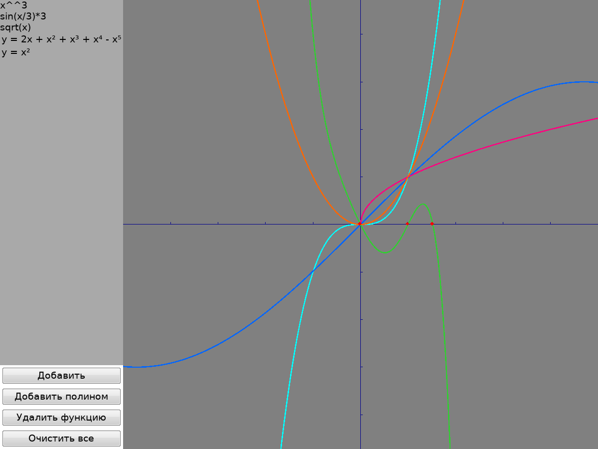

# GraphEquationSolver 📈

A graphical equation solver and function plotter written in D language. This application provides an interactive GUI for visualizing mathematical functions, solving polynomial equations, and exploring mathematical relationships in real-time.

## Features

### 🎨 Interactive Function Visualization
- **Real-time plotting** of multiple mathematical functions simultaneously
- **Pan and zoom** capabilities for exploring different regions of the graph
- **Smooth rendering** with adaptive step sizing for accurate representation of steep functions
- **Color-coded functions** for easy distinction between multiple plots
- **Coordinate axes** with grid marks and tick labels

### 🔢 Multiple Function Types

#### 1. Polynomial Functions
- Support for polynomials of arbitrary degree
- **Root finding** using the bisection method with derivative analysis
- **Interactive tooltips** displaying precise root values when hovering over them
- **Real-time coefficient editing** through the UI
- Automatic validation of input coefficients

#### 2. Script Functions
- Evaluate arbitrary D expressions at runtime
- Support for complex mathematical expressions (e.g., `sin(x/3)*3`, `x^^3`, `sqrt(x)`)
- Uses `rdmd` for dynamic evaluation
- Syntax validation and error handling
- Edit formulas in real-time through the UI

#### 3. Built-in Functions
- Predefined functions: `x²`, `sin(x)`, `tan(x)`, oscillator `sin(1/x)`
- Extensible architecture for adding custom function types

### 🛠️ Advanced Capabilities
- **Root visualization** with red markers on polynomial functions
- **Numerical methods**: bisection method, derivative calculation
- **Exception handling** with custom exceptions for validation and evaluation errors
- **Process management** for safely spawning and cleaning up script evaluation processes
- **Coordinate mapping** between screen pixels and mathematical coordinates
- **Function list management**: add, remove, and clear functions dynamically

### 🎯 User Interface
- Sidebar with function list
- Function selection for editing parameters
- Buttons for adding, removing, and clearing functions
- Resizable window (default: 1200x900)
- Russian language UI labels (Cyrillic support)

## Requirements

- **D Compiler** (DMD, LDC, or GDC)
- **DUB** (D package manager)
- **dlangui** library (automatically fetched by DUB)
- **rdmd** (for script function evaluation)
- Linux, Windows, or macOS

## Installation

1. Clone the repository:
```bash
git clone https://github.com/DlangProjectsTeam/
cd DlangProjectsTeam/GraphEquationSolver
```

2. Build the project using DUB:
```bash
dub build
```

3. Run the application:
```bash
dub run
```

## Usage

### Running the Application

When you launch GraphEquationSolver, it will open with several pre-loaded example functions:
- `x³` (cubic polynomial)
- `sin(x/3) * 3` (trigonometric function)
- `√x` (square root function)
- Polynomial: `y = -x⁵ + x⁴ + x³ + x² - 2x`
- Parabola: `y = x²`

### Interacting with the Graph

- **Pan**: Click and drag with the left mouse button to move around the graph
- **Zoom**: Use the mouse wheel to zoom in and out
- **View roots**: Hover over red markers on polynomial functions to see precise root values
- **Select function**: Click on a function in the left sidebar to edit its parameters

### Adding Functions

#### Interactive UI (Recommended)
- **"Добавить"** button: Opens a dialog to input mathematical formulas (e.g., `cos(x)`, `x^^2 + sin(x)`)
- **"Добавить полином"** button: Opens a dialog to input polynomial coefficients (e.g., `1, -2, 1` for y = x² - 2x + 1)

#### Programmatic API
You can also add functions programmatically by modifying `src/app.d`:

```d
// Add a script function
wc.addScriptFunction("cos(x)");

// Add a polynomial: y = a₀ + a₁x + a₂x² + ...
wc.addPolinomFunction([1, -2, 1]); // y = x² - 2x + 1
```

### Editing Functions

- **Polynomial coefficients**: Select a polynomial from the list and edit individual coefficients in the sidebar
- **Script formulas**: Select a script function and edit its formula in the text field
- Press Enter to apply changes

### Removing Functions

- Select a function from the list
- Click the **"Удалить функцию"** (Remove Function) button
- Or click **"Очистить все"** (Clear All) to remove all functions

## Architecture

### Project Structure

```
GraphEquationSolver/
├── src/
│   ├── app.d                          # Main entry point
│   └── eqsolver/                      # Core package
│       ├── package.d                  # Package exports
│       ├── Function.d                 # Function interface and basic implementations
│       ├── Polinom.d                  # Polynomial class with root finding
│       ├── ScriptFunction.d           # Dynamic D expression evaluator
│       ├── GraphPanel.d               # Graph rendering widget
│       ├── GraphWindowController.d    # Main window and UI controller
│       ├── FunctionPanel.d            # Function editing panels
│       ├── CoordinateMapper.d         # Coordinate system conversion
│       ├── PointD.d                   # Double-precision point
│       ├── RectD.d                    # Double-precision rectangle
│       └── Exceptions.d               # Custom exception types
├── dub.json                           # DUB package configuration
└── README.md                          # This file
```

### Key Components

#### 1. **GraphWindowController**
- Manages the main application window
- Handles function list and UI sidebar
- Coordinates between UI panels and the graph

#### 2. **GraphPanel**
- Renders functions on the coordinate plane
- Handles mouse events (pan, zoom, tooltips)
- Manages viewport and coordinate transformations
- Implements adaptive rendering for smooth curves

#### 3. **Polinom**
- Polynomial function implementation
- Root finding using bisection method
- Derivative calculation
- Coefficient validation and management
- String representation with superscript notation

#### 4. **ScriptFunction**
- Evaluates D expressions dynamically using `rdmd`
- Spawns and manages external processes
- Handles process cleanup and error recovery
- Formula validation and syntax checking

#### 5. **CoordinateMapper**
- Converts between screen coordinates and mathematical coordinates
- Maintains viewport state
- Handles aspect ratio and scaling

### Numerical Methods

#### Bisection Method
The polynomial root finder uses the bisection method with derivative analysis:
1. Calculate the derivative of the polynomial
2. Find critical points (roots of the derivative)
3. Check for roots in intervals between critical points
4. Apply bisection to narrow down root locations
5. Use configurable tolerance for precision

#### Adaptive Rendering
The graph renderer adjusts step size based on function steepness:
- Base step size: 0.005
- Adaptive subdivision for steep regions
- Maximum 100 iterations for challenging functions

## Examples

### Example 1: Plotting a Custom Polynomial

```d
// Plot y = 2x³ - 3x² + x - 5
wc.addPolinomFunction([-5, 1, -3, 2]);
```

### Example 2: Trigonometric Functions

```d
wc.addScriptFunction("sin(x)");
wc.addScriptFunction("cos(x)");
wc.addScriptFunction("tan(x/2)");
```

### Example 3: Complex Expressions

```d
wc.addScriptFunction("exp(-x^^2/2)");           // Gaussian
wc.addScriptFunction("x*sin(1/x)");             // Oscillating function
wc.addScriptFunction("log(abs(x))");            // Logarithm
wc.addScriptFunction("(1+x)^^(1/x)");           // Approaches e
```

## Technical Details

### Validation and Error Handling

The application includes comprehensive validation:
- **Coefficient validation**: Checks for NaN, infinity, and empty arrays
- **Range validation**: Ensures valid intervals for root finding
- **Formula validation**: Detects syntax errors and dangerous imports
- **Evaluation error handling**: Gracefully handles numerical issues

### Performance Optimizations

- **Caching**: Roots are cached per viewport range
- **Lazy evaluation**: Functions only evaluated when visible
- **Process reuse**: Script functions reuse evaluation processes
- **Adaptive rendering**: Reduces redundant computations

### Coordinate System

- Default viewport: x ∈ [-5, 5], auto-calculated y range
- Zoom range: [1e-10, 1e10]
- Grid step: configurable (default 1.0 for both axes)


## Development

### Building from Source

```bash
# Debug build
dub build

# Release build with optimizations
dub build --build=release

# Run tests
dub test
```

### Adding New Function Types

To add a custom function type:

1. Create a class implementing the `Function` interface:
```d
class MyFunction : Function
{
    override double eval(double x)
    {
        return /* your formula */;
    }
    
    override string toString() const
    {
        return "y = /* description */";
    }
}
```

2. Add it to the graph:
```d
wc.addCustomFunction(new MyFunction());
```

## Known Limitations

- Script functions require `rdmd` to be available in PATH
- Process spawning for script functions may have platform-specific behavior
- Very steep functions may show rendering artifacts
- Root finding only works for polynomial functions
- UI text is primarily in Russian (can be localized)

## Credits

- Built with [dlangui](https://github.com/buggins/dlangui) - cross-platform GUI library for D

## Screenshots


*Main application window showing interactive function plotting with polynomial and trigonometric functions*

---

**Enjoy exploring mathematics with GraphEquationSolver!** 🎓📊

